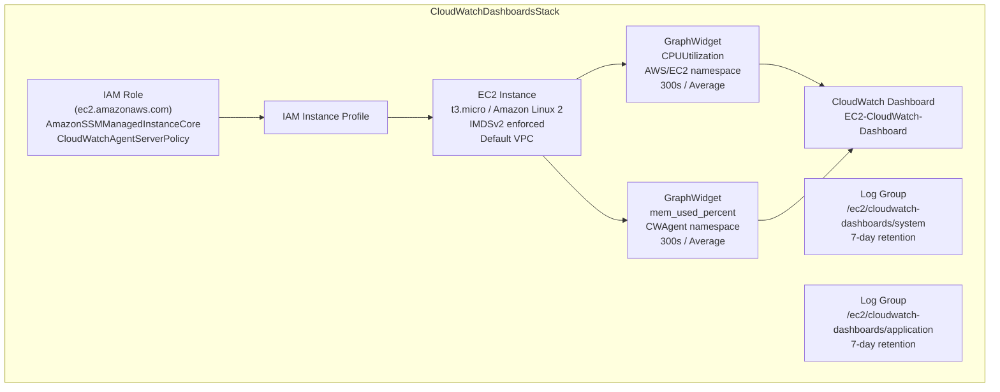
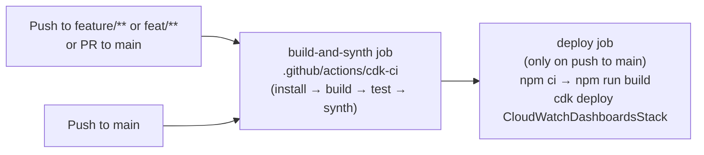

# Design Document — CloudWatch Dashboards (Topic 03)

## Overview

This document describes the technical design for `CloudWatchDashboardsStack`, the CDK stack that provisions an EC2 instance with CloudWatch observability for the `agentic-sdlc-pilot` project. The stack is scoped to topic 03 and covers three infrastructure concerns:

1. An EC2 instance with a least-privilege IAM role, IMDSv2 enforcement, and SSM/CloudWatch Agent access.
2. Two CloudWatch Log Groups for system and application logs from that instance.
3. A CloudWatch Metrics Dashboard with CPU and memory utilization widgets.

The GitHub Actions CI/CD workflow is also extended with a CD (deploy) stage that runs on merges to `main`.

All implementation is confined to:
- `lib/topics/03-cloudwatch-dashboards/cloudwatch-dashboards-stack.ts` — the CDK stack
- `bin/app.ts` — stack registration
- `.github/workflows/ci-cloudwatch-dashboards.yml` — CI/CD workflow

### Technology Stack

| Concern | Choice |
|---|---|
| IaC framework | AWS CDK v2 (`aws-cdk-lib` 2.256.0) |
| Language | TypeScript 5.x, Node 20 |
| Constructs library | `constructs` 10.6.0 |
| Test framework | Jest 29 + `aws-cdk-lib/assertions` |
| CI/CD | GitHub Actions |
| Target account | `process.env.AWS_ACCOUNT_ID`, region `us-east-1` |

---

## Architecture

The stack is a single CDK `Stack` class. All resources are defined inline — no nested stacks, no cross-stack references.



### CI/CD Pipeline



---

## Components and Interfaces

### `CloudWatchDashboardsStack` (CDK Stack)

**File:** `lib/topics/03-cloudwatch-dashboards/cloudwatch-dashboards-stack.ts`

```typescript
export class CloudWatchDashboardsStack extends cdk.Stack {
  constructor(scope: Construct, id: string, props?: cdk.StackProps) { ... }
}
```

The constructor creates all resources in dependency order:

1. **IAM Role** — `iam.Role` with trust principal `ec2.amazonaws.com` and two managed policies attached.
2. **EC2 Instance** — `ec2.Instance` referencing the role via an instance profile, placed in the default VPC.
3. **Log Groups** — two `logs.LogGroup` constructs with fixed names, 7-day retention, and `DESTROY` removal policy.
4. **Dashboard** — `cloudwatch.Dashboard` with two `cloudwatch.GraphWidget` constructs, each referencing the EC2 instance's `instanceId`.

#### IAM Role

| Property | Value |
|---|---|
| Trust principal | `ec2.amazonaws.com` |
| Managed policies | `AmazonSSMManagedInstanceCore`, `CloudWatchAgentServerPolicy` |
| Purpose | Enables SSM Session Manager (no SSH) and CloudWatch Agent metric/log publishing |

#### EC2 Instance

| Property | Value |
|---|---|
| Instance type | `t3.micro` |
| AMI | `ec2.MachineImage.latestAmazonLinux2()` |
| VPC | `ec2.Vpc.fromLookup(this, 'DefaultVpc', { isDefault: true })` |
| IMDSv2 | `requireImdsv2: true` |
| IAM role | The role defined above |

#### Log Groups

| Name | Retention | Removal Policy |
|---|---|---|
| `/ec2/cloudwatch-dashboards/system` | `RetentionDays.ONE_WEEK` (7 days) | `RemovalPolicy.DESTROY` |
| `/ec2/cloudwatch-dashboards/application` | `RetentionDays.ONE_WEEK` (7 days) | `RemovalPolicy.DESTROY` |

#### CloudWatch Dashboard

**Dashboard name:** `EC2-CloudWatch-Dashboard`

| Widget | Metric | Namespace | Dimension | Period | Statistic |
|---|---|---|---|---|---|
| CPU Utilization | `CPUUtilization` | `AWS/EC2` | `InstanceId` | 300s | `Average` |
| Memory Utilization | `mem_used_percent` | `CWAgent` | `InstanceId` | 300s | `Average` |

Both widgets use `new cloudwatch.Metric({ ... })` with `dimensionsMap: { InstanceId: instance.instanceId }`.

### `bin/app.ts` — Stack Registration

```typescript
new CloudWatchDashboardsStack(app, 'CloudWatchDashboardsStack', {
  env: { account: process.env.AWS_ACCOUNT_ID, region: 'us-east-1' },
});
```

The construct ID `'CloudWatchDashboardsStack'` becomes the deployed CloudFormation stack name, making it addressable by `cdk synth CloudWatchDashboardsStack` and `cdk deploy CloudWatchDashboardsStack`.

### GitHub Actions Workflow

**File:** `.github/workflows/ci-cloudwatch-dashboards.yml`

#### `build-and-synth` job

- Runs on: `ubuntu-latest`
- Triggers: push to `feature/**` / `feat/**`, PR to `main`, push to `main` — all scoped to `lib/topics/03-cloudwatch-dashboards/**`
- Steps: `actions/checkout@v4` → `.github/actions/cdk-ci` (composite action) with `stack-name: 'CloudWatchDashboardsStack'`
- The composite action handles: `setup-node@v4` → `npm ci` → `npm run build` → `npm test` → `cdk synth CloudWatchDashboardsStack`

#### `deploy` job

- Runs on: `ubuntu-latest`
- Condition: `github.ref == 'refs/heads/main' && github.event_name == 'push'`
- Needs: `build-and-synth`
- Environment variables: `CDK_DEFAULT_ACCOUNT: ${{ vars.AWS_ACCOUNT_ID }}`, `CDK_DEFAULT_REGION: us-east-1`
- Steps:
  1. `actions/checkout@v4`
  2. `aws-actions/configure-aws-credentials@v4` with `AWS_ACCESS_KEY_ID` / `AWS_SECRET_ACCESS_KEY` secrets, region `us-east-1`
  3. `npm ci`
  4. `npm run build`
  5. `npx cdk deploy CloudWatchDashboardsStack --require-approval never`

---

## Data Models

This stack is purely declarative IaC — there are no runtime data models or application-level data structures. The relevant "data" is the CloudFormation template produced by `cdk synth`.

### CloudFormation Resource Summary

| CloudFormation Resource Type | Logical ID (approximate) | Count |
|---|---|---|
| `AWS::IAM::Role` | `CloudWatchDashboardsRole` | 1 |
| `AWS::IAM::InstanceProfile` | `CloudWatchDashboardsInstanceProfile` | 1 |
| `AWS::EC2::Instance` | `CloudWatchDashboardsInstance` | 1 |
| `AWS::Logs::LogGroup` | `SystemLogGroup`, `ApplicationLogGroup` | 2 |
| `AWS::CloudWatch::Dashboard` | `EC2CloudWatchDashboard` | 1 |

### Dashboard Body Schema

The `DashboardBody` property of `AWS::CloudWatch::Dashboard` is a JSON string. Its structure follows the CloudWatch dashboard widget schema:

```json
{
  "widgets": [
    {
      "type": "metric",
      "properties": {
        "metrics": [["AWS/EC2", "CPUUtilization", "InstanceId", "<instance-id>"]],
        "period": 300,
        "stat": "Average",
        "title": "CPU Utilization"
      }
    },
    {
      "type": "metric",
      "properties": {
        "metrics": [["CWAgent", "mem_used_percent", "InstanceId", "<instance-id>"]],
        "period": 300,
        "stat": "Average",
        "title": "Memory Utilization"
      }
    }
  ]
}
```

### Resource Tagging Convention

All resources are tagged with the project's standard tags via CDK `Tags.of(this).add(...)` or per-resource `tags` props:

| Tag Key | Value |
|---|---|
| `Project` | `agentic-sdlc-pilot` |
| `Owner` | `Sridhar` |
| `Topic` | `03-cloudwatch-dashboards` |

---

## Correctness Properties

This feature is Infrastructure as Code (CDK/CloudFormation). All acceptance criteria describe declarative configuration — resource types, property values, and structural relationships in the synthesized CloudFormation template. These are one-time structural checks where running 100 randomized iterations adds no value over a single deterministic assertion.

**PBT does not apply to this feature.** The appropriate testing strategy is CDK snapshot tests and CDK `assertions` library checks, which verify the synthesized template structure deterministically. See the Testing Strategy section for the full test plan.

### Why No Property-Based Tests

Applying the PBT decision guide to each acceptance criterion:

- **Does behavior vary meaningfully with input?** No. The CDK stack constructor takes no variable inputs — it always produces the same CloudFormation template for a given CDK version and account/region context. There is no input space to explore.
- **Are we testing our code or external services?** We are testing CloudFormation template structure, which is deterministic and configuration-driven, not logic-driven.
- **Would 100 iterations find more bugs than 1?** No. The synthesis is deterministic; running it 100 times produces identical output.

All acceptance criteria map to SMOKE tests (single-execution CDK assertions). The CDK `assertions` library (`Template.fromStack`) is the correct tool for this feature.

### Property 1: CloudFormation template is structurally valid and complete

*For any* valid CDK synthesis of `CloudWatchDashboardsStack`, the resulting CloudFormation template SHALL contain exactly one `AWS::EC2::Instance`, exactly two `AWS::Logs::LogGroup` resources, and exactly one `AWS::CloudWatch::Dashboard` whose `DashboardBody` contains both `CPUUtilization` and `mem_used_percent`.

**Validates: Requirements 1.2, 2.5, 3.6**

> **Note:** This property is implemented as a deterministic CDK assertions test (not a randomized property-based test), because CDK synthesis is a pure function of the stack definition with no variable input space. The `Template.fromStack` API is the appropriate verification tool.

---

## Error Handling

### CDK Synthesis Errors

| Scenario | Behavior |
|---|---|
| Default VPC not found in account | `ec2.Vpc.fromLookup` throws a synthesis-time error; `cdk synth` exits non-zero. The CI `build-and-synth` job fails and blocks the `deploy` job. |
| Invalid instance type string | CDK throws a compile-time TypeScript error; `npm run build` fails in CI. |
| Missing IAM managed policy ARN | CDK synthesis succeeds but CloudFormation deployment fails with `NoSuchEntity`. The `--require-approval never` flag does not suppress this; the deploy step exits non-zero. |
| Dashboard body serialization failure | CDK throws at synthesis time if widget metric configuration is invalid. |

### Deployment Errors

| Scenario | Behavior |
|---|---|
| Insufficient IAM permissions for deployer | `cdk deploy` exits non-zero with an `AccessDenied` error. The GitHub Actions `deploy` job fails and the workflow reports failure. |
| CloudFormation stack already in `ROLLBACK_COMPLETE` state | `cdk deploy` fails. Manual stack deletion is required before re-deploying. |
| Log group already exists with different retention | CloudFormation update proceeds; retention is updated in place. |

### Removal Policy Behavior

Both log groups use `RemovalPolicy.DESTROY`. When `cdk destroy` is run, CloudFormation deletes the log groups and all contained log streams. This is intentional for development teardown but means log data is permanently lost. Production deployments should use `RemovalPolicy.RETAIN`.

---

## Testing Strategy

This feature uses CDK's built-in `assertions` library for all automated tests. PBT is not applicable (see Correctness Properties section).

### Test File Location

`test/03-cloudwatch-dashboards/cloudwatch-dashboards-stack.test.ts`

### Test Approach: CDK Assertions (Snapshot + Fine-Grained)

All tests synthesize `CloudWatchDashboardsStack` in isolation using a test CDK `App` and then assert against the resulting CloudFormation template using `Template.fromStack(stack)`.

#### EC2 Instance Tests (Requirements 1.x)

```
- resourceCountIs('AWS::EC2::Instance', 1)
- hasResourceProperties('AWS::EC2::Instance', { InstanceType: 't3.micro' })
- hasResourceProperties('AWS::EC2::LaunchTemplate', {
    LaunchTemplateData: { MetadataOptions: { HttpTokens: 'required' } }
  })
- hasResourceProperties('AWS::IAM::Role', {
    AssumeRolePolicyDocument: { Statement: [{ Principal: { Service: 'ec2.amazonaws.com' } }] },
    ManagedPolicyArns: [
      { 'Fn::Join': [...'AmazonSSMManagedInstanceCore'...] },
      { 'Fn::Join': [...'CloudWatchAgentServerPolicy'...] }
    ]
  })
- hasResourceProperties('AWS::EC2::Instance', {
    IamInstanceProfile: { Ref: <InstanceProfileLogicalId> }
  })
```

#### Log Group Tests (Requirements 2.x)

```
- resourceCountIs('AWS::Logs::LogGroup', 2)
- hasResourceProperties('AWS::Logs::LogGroup', {
    LogGroupName: '/ec2/cloudwatch-dashboards/system',
    RetentionInDays: 7
  })
- hasResourceProperties('AWS::Logs::LogGroup', {
    LogGroupName: '/ec2/cloudwatch-dashboards/application',
    RetentionInDays: 7
  })
- Both log groups have DeletionPolicy: 'Delete' (RemovalPolicy.DESTROY)
```

#### Dashboard Tests (Requirements 3.x)

```
- resourceCountIs('AWS::CloudWatch::Dashboard', 1)
- hasResourceProperties('AWS::CloudWatch::Dashboard', {
    DashboardName: 'EC2-CloudWatch-Dashboard'
  })
- DashboardBody string contains 'CPUUtilization', 'AWS/EC2', 'mem_used_percent', 'CWAgent'
- DashboardBody JSON contains period: 300 and stat: 'Average' for both metrics
```

#### Snapshot Test

A CDK snapshot test captures the full synthesized template. Any unintended structural change (added resource, changed property) causes the snapshot to fail, prompting a deliberate review before updating.

```typescript
expect(template.toJSON()).toMatchSnapshot();
```

### CI Verification

The `build-and-synth` job in GitHub Actions runs `npm test` (which executes all Jest tests) and then `cdk synth CloudWatchDashboardsStack`. Both must pass for the job to succeed. The `deploy` job only runs after `build-and-synth` succeeds on `main`.

### Manual Verification Checklist

After deployment to `$AWS_ACCOUNT_ID / us-east-1`:

1. `aws cloudformation describe-stacks --stack-name CloudWatchDashboardsStack` returns `CREATE_COMPLETE` or `UPDATE_COMPLETE`.
2. EC2 console shows one `t3.micro` instance with the expected IAM instance profile.
3. CloudWatch Logs console shows both log groups with 7-day retention.
4. CloudWatch Dashboards console shows `EC2-CloudWatch-Dashboard` with two widgets.
5. SSM Session Manager can connect to the instance (validates `AmazonSSMManagedInstanceCore`).
